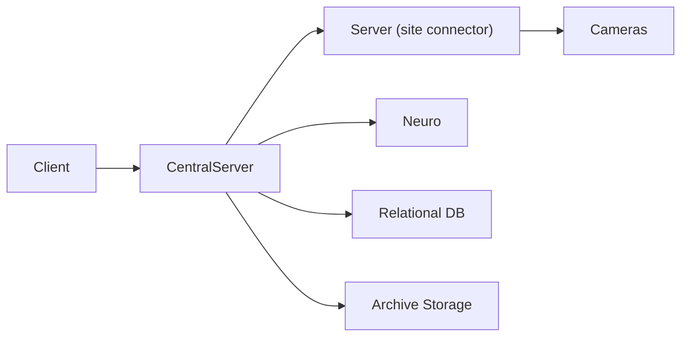

# CentralServer + Neuro Detection Product Implementation Specification

## Purpose

This document defines the target implementation map for the centralized video analytics product in:

- `/Users/chirill/Работа/webArchiveRetrieval/CentralisationService/Client`
- `/Users/chirill/Работа/webArchiveRetrieval/CentralisationService/CentralServer/CentralServer`
- `/Users/chirill/Работа/webArchiveRetrieval/CentralisationService/Server/Server`
- `/Users/chirill/Работа/webArchiveRetrieval/CentralisationService/Neuro/Neuro`

It is based on the current `CentralisationService` direction and the original behavior implemented in:

- `/Users/chirill/Работа/webService/TobaccoServer`
- `/Users/chirill/Работа/webService/neuro`
- `/Users/chirill/Работа/webService/CentralServerWeb`
- `/Users/chirill/Работа/webService/TobaccoEntitiesWeb`

This specification is the implementation contract for the new product. When a behavior conflict appears, the product should follow this document unless an explicit architectural decision supersedes it.

## Mandatory Architectural Rule

All business analytics, motion processing, archive creation, evidence generation, incident finalization, and AI orchestration must run on `CentralServer`.

Allowed flows:

- `Client -> CentralServer`
- `CentralServer -> Server`
- `CentralServer -> Neuro`
- `Server -> camera`

Forbidden flows:

- `Client -> Server`
- `Server -> Neuro`
- `Server` finalizing violations
- `Server` storing the source-of-truth archive

## Core Product Goal

Build a production-ready centralized system where:

- `Server` is a weak site connector that exposes access to point cameras;
- `CentralServer` owns the runtime catalog, stream orchestration, motion archive, store context, detection scheduler, incident state, and all business rules;
- `Neuro` is a centralized inference backend that solves low-level CV and ML tasks only;
- `Client` is an operator console for configuration, live preview, archive, incidents, and analytics.

## Architecture Overview



## Multi-Tenant Access And Company Isolation

`Company` is the strict top-level boundary for configuration, processing, archives, incidents, and user access.

Core access entities:

- `PlatformAdministrator` is a service-side administrator identity used by developers and platform operators;
- `PlatformAdminSession` is a short-lived bearer session for the administration UI and platform APIs;
- `Company` owns one or more sites and has an independent service status and optional access expiration;
- `CompanyInvitation` is a one-time token that creates or grants an account access to one company;
- `Account` is a reusable user identity;
- `CompanyAccessGrant` binds an account to a company, role, permissions, and optional expiration;
- `AccessSession` is a short-lived bearer session used by the client after activation or login.

Access is allowed only when all conditions are true:

- company status is `active`;
- company access expiration has not passed;
- account is enabled;
- company grant is enabled and has not expired;
- session is active and has not expired;
- requested data belongs to the session company;
- the grant contains the required permission.

One company may have multiple invitations and accounts. Disabling or expiring a company immediately invalidates all related invitations, grants, sessions, site processing, Neuro dispatch, archive creation, and incident creation. Existing data is preserved.

Invitation rules:

- tokens are generated cryptographically and shown only once;
- only token hashes are persisted;
- an invitation can be activated once;
- invitation expiration also becomes the created company grant expiration;
- platform administrators may revoke invitations or extend grants;
- platform administrators may create companies, update company service status, manage stores, inspect statuses, and issue invitation tokens;
- normal company users cannot create platform administrators.

Platform administration rules:

- platform admin authentication is separate from company authentication;
- platform admin sessions must not pass through company-scoped APIs as company users;
- the first development account is configured as `admin` / `1234` only for local testing;
- production deployments must move platform admin credentials to environment variables, secrets storage, or a real users table;
- platform APIs may support a technical `X-Platform-Admin-Key` for scripts, but the web interface uses a bearer `PlatformAdminSession`.

All client-facing CentralServer APIs must resolve `companyId` from the active session. Requests for entities belonging to another company return `404`.

JSON-backed first-stage persistence is physically separated:

```text
Configuration/
  access/
    companies.json
    accounts.json
    grants.json
    invitations.json
    sessions.json
    platform-sessions.json
```

The JSON repository must use atomic file replacement and remain replaceable by a relational database without changing API contracts.

Target database recommendation:

- use PostgreSQL as the main DBMS;
- keep a control/admin schema for platform administrators, companies, invitations, accounts, grants, sessions, and operational status;
- keep company-owned data company-scoped by `company_id` at first;
- when stronger isolation is needed, move large customers to separate PostgreSQL schemas or separate databases without changing API contracts;
- keep video/archive binary data outside the relational database, partitioned by company/site/camera in filesystem or object storage.

## Company Site Connector Binding

Site-side `Server` instances are attached to companies only through `CentralServer`.

Administrative flow:

- platform administrator creates or opens a company;
- platform administrator adds a site-side `Server` address for that company;
- `CentralServer` generates a connector access token;
- `CentralServer` calls `Server /api/connector/register`;
- site-side `Server` persists company/site binding and a hash of the connector token;
- `CentralServer` persists the site binding under the owning company and uses the raw connector token for future transport calls;
- `CentralServer` pings the site-side `Server` and exposes availability in the admin UI.

Rules:

- company users never bind site-side servers directly;
- site-side `Server` remains transport-only and stores no analytics state;
- after binding, site-side camera and frame endpoints require `X-Connector-Token`;
- disabling a company must make all related sites unavailable for company users;
- admin UI must show company sites, connector availability, cameras, users, invitations, and invitation expiration/revocation status.

First-stage JSON persistence:

```text
CentralServer/Configuration/access/company-sites.json
Server/Configuration/connector-binding.json
```

Database migration target:

- `company_sites` table in the control/admin schema;
- connector token secrets in a protected secret store or encrypted DB column;
- connector audit events for registration, token rotation, and failed pings.

## Why The Original Logic Must Be Split

The original `TobaccoServer` already shows that a violation is not equal to a raw neural network answer.

The old platform has four logical layers:

1. `Neuro` solves frame or short-window vision tasks.
2. `TobaccoServer` computes people context and temporal state.
3. `TobaccoServer` applies business rules, thresholds, cooldowns, schedules, and finalization.
4. `TobaccoServer` stores incidents and evidence.

The new architecture must preserve this separation, but move layers `2-4` into `CentralServer`.

## Original Detection Families

Based on:

- `/Users/chirill/Работа/webService/TobaccoServer/TobacoServer/Configuration/periodal_tasks.json`
- `/Users/chirill/Работа/webService/TobaccoServer/TobacoServer/Services/VideoService.cs`
- `/Users/chirill/Работа/webService/neuro/Neuro/Controllers/VisionController.cs`
- `/Users/chirill/Работа/webService/neuro/Neuro/Services/CVHelperService.cs`

The original platform is not one single detector. It is a collection of distinct inference families:

1. `People count`
2. `Person ROI + object detector`
3. `Single-frame classification`
4. `Pose-assisted detection`
5. `Directional tracking`
6. `Reference template / surface difference`
7. `Simple image heuristic`
8. `Business state machine`

That distinction must be explicit in the new design.

## CentralServer First: Main Service Decomposition

`CentralServer` is the product brain and should be organized into the following runtime modules.

### 1. Catalog And Configuration Module

Purpose:

- store companies, sites, servers, cameras, zones, employees, schedules, and detection profiles;
- own all runtime configuration instead of relying on `appsettings.json`.

Core entities:

- `Company`
- `Site`
- `ServerNode`
- `Camera`
- `Employee`
- `Zone`
- `DetectionType`
- `DetectionProfile`
- `DetectionSchedule`
- `ArchivePolicy`
- `IncidentPolicy`

Rules:

- every detection is enabled or disabled via `DetectionProfile`;
- every profile must be bound to `Site`, `Camera`, `Zone`, and `DetectionType`;
- every profile may have its own interval, thresholds, cooldown, and time windows.

### 2. Camera Ingest Module

Purpose:

- retrieve frames or streams from `Server`;
- reuse them across multiple detection types;
- support both live preview and analytics.

Responsibilities:

- maintain a per-camera frame cache;
- support `analytics stream` and `archive stream` separately;
- enforce timeouts and retry policy;
- normalize frame metadata such as `cameraKey`, `capturedAtUtc`, `width`, `height`, `sourceLatency`.

Recommended strategy:

- use lower-quality substream for analytics;
- use higher-quality main stream for archive/evidence;
- fetch one frame and reuse it for multiple checks in the same scheduler slice.

### 3. Motion Archive Module

Purpose:

- decide when the system should preserve archive material;
- store motion-driven clips or snapshots centrally.

Responsibilities:

- lightweight motion gating;
- archive segment creation;
- evidence frame extraction;
- retention and storage tier policy.

Recommended behavior:

- do not archive full-frame full-time on day one;
- save motion segments and evidence frames;
- keep incident JPEGs and short MP4 clips;
- persist archive only on `CentralServer`.

### 4. Store Context Module

Purpose:

- compute the shared business context for a store and camera.

This is one of the most important pieces of the system. Many original detections depend not on a raw image, but on whether:

- there are customers in the store;
- there are customers in the client zone;
- there is a seller at the stall;
- there are too many people near the stall;
- a conversion session is active;
- a service session near a cabinet is ongoing.

The module should produce reusable snapshots such as:

- `clientZonePeopleCount`
- `stallZonePeopleCount`
- `cabinetZonePeopleCount`
- `conversionZoneDirectionalState`
- `sellerPresence`
- `motionActive`

This module must be shared. The system must not re-run people counting independently for every defect type.

### 5. Detection Scheduler Module

Purpose:

- replace the old per-job timer style with one centralized scheduler.

Responsibilities:

- scan active `DetectionProfile` records;
- decide which profiles are due;
- spread execution in time to avoid spikes;
- group work by camera and by `model family`;
- skip stale work if the system is behind.

Important rule:

- do not create `cameraCount * defectTypeCount` independent OS timers;
- build one scheduler loop with deterministic queueing and fairness.

### 6. Inference Dispatch Module

Purpose:

- convert detection intents into batched `Neuro` calls.

Responsibilities:

- build ROI crops;
- group tasks by `model family`;
- batch tasks for throughput;
- set per-family timeouts;
- limit in-flight requests;
- capture inference audit data.

The dispatcher should create separate queues such as:

- `peopleCountQueue`
- `personObjectQueue`
- `classificationQueue`
- `smokeQueue`
- `directionalQueue`
- `surfaceDifferenceQueue`

### 7. Incident State Module

Purpose:

- transform raw or batched inference outputs into business incidents.

Responsibilities:

- temporal accumulation;
- majority voting;
- inactivity gap logic;
- cooldown and deduplication;
- long-window compliance aggregation;
- final incident creation.

This module is where the old `TobaccoServer` job logic belongs now.

### 8. Archive And Evidence Module

Purpose:

- persist everything needed for later review.

Store:

- evidence JPEGs;
- short incident clips;
- motion archive segments;
- thumbnails;
- incident metadata;
- links to source store, camera, zone, and detection profile.

### 9. Reporting And Statistics Module

Purpose:

- build business summaries and historical analytics.

Examples:

- incidents by day and type;
- crowd sessions by store;
- conversion stats;
- cashier compliance windows;
- audit metrics for badge or clothes checks.

## Neuro Second: Service Architecture

`Neuro` must remain low-level and inference-focused. It should not know how incidents are finalized.

### Neuro Design Rule

`Neuro` answers questions such as:

- how many people are in this ROI;
- is there a phone in this person crop;
- is the register open;
- is smoke visible in this temporal window;
- is the stall surface clear;
- how many directional entries crossed the line.

`Neuro` must not answer:

- should a violation be created;
- should this event be merged with the previous one;
- is there customer context for this frame;
- did the cashier fail the recounting window.

Those decisions belong to `CentralServer`.

### Neuro Inference Families

#### 1. People Count Family

Use for:

- `crowd control`
- `people at stall`
- `no one at stall too long`
- client-presence gating for `phone`, `smoke`, `pose`, `cash-register`

Input:

- one frame
- one ROI

Output:

- people count
- optional person boxes

#### 2. Person ROI + Object Detector Family

Use for:

- `phone`
- `bottles`
- `mopping`
- `badge`
- future `food`

Original behavior:

- detect person first;
- expand the person box;
- detect the target object inside the person crop.

This is already present in the original `CVHelperService` and should be preserved.

#### 3. Classification Family

Use for:

- `cash-register`
- `pose`
- `clothes`

Input:

- one ROI or person crop

Output:

- label
- confidence

#### 4. Smoke Family

Use for:

- `smoke`

Original behavior:

- pose keypoints;
- head region inference;
- smoke detector near the upper body;
- color heuristic to suppress false positives.

This should stay a specialized family and not be mixed with generic object detection.

#### 5. Directional Tracking Family

Use for:

- `conversion`

This family should own:

- entry-band geometry;
- directional crossing memory;
- track/session accumulation at the model side where needed.

Business conversion session finalization still belongs to `CentralServer`.

#### 6. Surface Difference Family

Use for:

- `clear stall`

Original behavior:

- compare current crop to a reference image;
- ignore people masks;
- compute whether the surface is clear.

This is a dedicated family and should remain separate from standard object detection.

#### 7. Image Heuristic Family

Use for:

- `light`

This can stay a lightweight family with no GPU dependency.

### Neuro APIs To Add

The old style of one HTTP call per one detector per one frame should evolve into batch APIs.

Recommended contracts:

- `POST /api/batch/people-count`
- `POST /api/batch/person-object`
- `POST /api/batch/classification`
- `POST /api/batch/smoke`
- `POST /api/batch/directional-entry`
- `POST /api/batch/clear-surface`

Every batch item should include:

- `siteKey`
- `cameraKey`
- `profileId`
- `detectionType`
- `capturedAtUtc`
- `zone`
- `frame or crop payload`
- `thresholds`
- `modelVersionHint`

Every batch response should include:

- `profileId`
- `success`
- `modelVersion`
- `latencyMs`
- `confidence`
- `detections or classification`
- `debug image reference if produced`

## Detection Logic By Type

The following section is the target logic for the new centralized product. It is derived from the original `TobaccoServer` jobs and must guide implementation.

### 1. Phone Detection

Original source:

- `/Users/chirill/Работа/webService/TobaccoServer/TobacoServer/Models/Jobs/PhoneDetectionJob.cs`

Logic:

- run only when `clientZonePeopleCount > 0`;
- query only configured `phone` zones;
- use `person + phone detector`;
- keep a session of positive detections;
- do not create an incident from a single positive frame;
- confirm after a minimum positive count in the active window;
- finalize on inactivity gap;
- keep one representative image per camera for evidence grid.

Recommended centralized implementation:

- cadence: `1-2 seconds`;
- gate: client presence required;
- confirmation: `>= 3` positives inside one session;
- finalization: inactivity gap of `~10 * interval`;
- cooldown: per camera and profile.

### 2. Bottle Detection

Original source:

- `/Users/chirill/Работа/webService/TobaccoServer/TobacoServer/Models/Jobs/BottleDetectionJob.cs`

Logic:

- use `person + bottle detector`;
- session accumulation identical to phone logic;
- no hard client-presence gate in the original code;
- evidence is composed from representative positive frames.

Recommended centralized implementation:

- cadence: `2-5 seconds`;
- gate: optional client or seller presence, configurable;
- confirmation: session-based, not single-frame;
- finalization: inactivity gap.

### 3. Smoke Detection

Original source:

- `/Users/chirill/Работа/webService/TobaccoServer/TobacoServer/Models/Jobs/SmokeDetectionJob.cs`

Logic:

- run only when `clientZonePeopleCount > 0`;
- use dedicated smoke family;
- original implementation creates a defect aggressively after a positive result;
- this is more noise-prone than phone or bottle.

Recommended centralized implementation:

- cadence: `500-1000 ms`;
- gate: client presence required;
- confirmation: temporal window or repeated positives;
- evidence: one or more annotated frames;
- add stronger debounce than the old implementation.

### 4. Mopping Detection

Original source:

- `/Users/chirill/Работа/webService/TobaccoServer/TobacoServer/Models/Jobs/MoppingJob.cs`

Logic:

- runs only in configured schedule windows;
- counts positive detections;
- marks the audit successful after enough positives;
- if the scheduled window ends and cleaning never happened, a failure is created.

Recommended centralized implementation:

- treat as a compliance window, not a constant real-time alert;
- cadence inside window: `1-2 seconds`;
- success threshold: configurable positive count;
- if window closes without success, create a store-level incident.

### 5. Cash Register Open/Closed Detection

Original source:

- `/Users/chirill/Работа/webService/TobaccoServer/TobacoServer/Models/Jobs/CashRegisterCheckJob.cs`

Logic:

- run only when `clientZonePeopleCount == 0`;
- for each check, perform multiple register classifications;
- apply majority voting in one tick;
- if repeated open-state confirmations continue over time, finalize incident.

Recommended centralized implementation:

- cadence: `2 seconds`;
- gate: no clients in client zone;
- per-tick method: `3-5` classifications or samples;
- session finalization: repeated confirmation over several checks.

### 6. Cash Register Recounting Window

Original source:

- `/Users/chirill/Работа/webService/TobaccoServer/TobacoServer/Models/Jobs/CountingCashRegisterCheck.cs`

Logic:

- only active inside configured time windows;
- if at least one valid register-open event happens, the window is successful;
- if the window ends without the expected event, create a failure.

Recommended centralized implementation:

- keep as a dedicated compliance workflow;
- do not model it as a generic incident stream;
- store explicit `window opened`, `window satisfied`, `window failed`.

### 7. Crowd Control

Original source:

- `/Users/chirill/Работа/webService/TobaccoServer/TobacoServer/Models/Jobs/CrowdControlJob.cs`

Logic:

- count people in client zones;
- if count exceeds threshold, start a session;
- keep max people count;
- finalize after inactivity gap.

Recommended centralized implementation:

- cadence: `3-5 seconds`;
- derived only from `people-count`;
- store duration, max people count, and evidence frames;
- threshold should be profile-configurable per store.

### 8. Too Many People At Stall

Original source:

- `/Users/chirill/Работа/webService/TobaccoServer/TobacoServer/Models/Jobs/CheckPeopleAtStallNumberJob.cs`

Logic:

- count people in stall zones;
- when `stallZonePeopleCount > 1`, start a crowding session near the stall;
- finalize after inactivity.

Recommended centralized implementation:

- share the same people-count snapshot with crowd control;
- allow independent thresholds for stall crowding and hall crowding.

### 9. No One At Stall For Too Long

Original source:

- `/Users/chirill/Работа/webService/TobaccoServer/TobacoServer/Models/Jobs/CheckPeopleAtStallNumberJob.cs`

Logic:

- when `stallZonePeopleCount == 0`, start absence timing;
- if absence duration exceeds threshold, the state becomes eligible for incident creation;
- finalize when people return or when the rule decides to persist immediately.

Recommended centralized implementation:

- use duration tracking, not single checks;
- keep store-specific thresholds in minutes;
- store both start and end times of absence.

### 10. Pose Classification

Original source:

- `/Users/chirill/Работа/webService/TobaccoServer/TobacoServer/Models/Jobs/PoseClassificationJob.cs`

Logic:

- run only when there are clients;
- start scenario after trigger;
- wait a configured offset;
- capture several samples with a short delta;
- apply majority vote to classify seated vs standing behavior.

Recommended centralized implementation:

- model this as a temporal scenario;
- do not classify once and decide immediately;
- preserve offset, sample count, and sample delta as profile fields.

### 11. Service Near Cabinet

Original source:

- `/Users/chirill/Работа/webService/TobaccoServer/TobacoServer/Models/Jobs/ServiceNearCabinetDetectionJob.cs`

Logic:

- observe three zones: cabinet, client, stall;
- detect initial service state;
- wait follow-up delay;
- if the state stays unchanged, create a failure;
- if the stall becomes empty and client flow grows, treat the session as served;
- suppress repeated failures until the store context changes sufficiently.

Recommended centralized implementation:

- implement as a dedicated state machine in `CentralServer`;
- use one specialized `Neuro` response or one shared people-context snapshot;
- persist explicit service-session transitions.

### 12. Conversion

Original source:

- `/Users/chirill/Работа/webService/TobaccoServer/TobacoServer/Models/Jobs/ConversionRegisterJob.cs`

Logic:

- use directional entry counting in a dedicated conversion zone;
- keep conversion session state;
- finalize sessions by inactivity and context changes;
- update both event-level and aggregate-level statistics.

Recommended centralized implementation:

- treat conversion as a statistics workflow, not a defect stream;
- store session records and daily aggregates separately;
- keep it under the same central scheduling layer but not under the same incident finalization logic as phone or smoke.

### 13. Clear Stall

Original source:

- `/Users/chirill/Работа/webService/TobaccoServer/TobacoServer/Models/Jobs/ClearStallDetectionJob.cs`

Logic:

- compare live surface to reference state;
- ignore people areas;
- if the surface is not clear repeatedly, collect evidence;
- finalize only after enough repeated negatives.

Recommended centralized implementation:

- cadence: low, for example `30-60 seconds`;
- keep reference image management under central config;
- keep confirmation threshold configurable.

### 14. Clothes Control

Original source:

- `/Users/chirill/Работа/webService/TobaccoServer/TobacoServer/Models/Jobs/ClothesControlJob.cs`

Logic:

- this is a periodic compliance audit;
- if a seller is present, gather many repeated classifications;
- majority vote decides compliance.

Recommended centralized implementation:

- do not run this as a high-frequency live defect;
- create a `compliance audit job` profile family;
- store the audit result separately from momentary incidents.

### 15. Badge Detection

Original source:

- `/Users/chirill/Работа/webService/TobaccoServer/TobacoServer/Models/Jobs/BadgeDetectionJob.cs`

Logic:

- long-window ratio check;
- count all valid observations when a seller is visible;
- count positive badge observations;
- if the ratio is below threshold by window end, create a failure.

Recommended centralized implementation:

- treat as a long-window KPI or compliance violation;
- do not model it as a per-frame incident;
- keep ratio threshold configurable.

### 16. Light Detection

Original source:

- `/Users/chirill/Работа/webService/TobaccoServer/TobacoServer/Models/Jobs/LightDetectionJob.cs`

Logic:

- low-cost heuristic;
- if all lights in the zone appear off repeatedly, start evidence accumulation;
- finalize after repeated confirmations.

Recommended centralized implementation:

- keep CPU-only;
- cadence: low;
- separate from GPU-intensive workloads.

### 17. Food Detection

Original source:

- `/Users/chirill/Работа/webService/TobaccoServer/TobacoServer/Models/Jobs/FoodDetectionJob.cs`

Logic:

- currently commented out in the original implementation;
- intended behavior is similar to other customer-presence-sensitive detectors.

Recommended centralized implementation:

- treat as future `person + object` or classifier family;
- gate by customer presence if business logic requires it.

### 18. Abandoned Open Cash Register

Original source:

- `/Users/chirill/Работа/webService/TobaccoServer/TobacoServer/Models/Jobs/AbandonedOpenCashRegisterJob.cs`

Logic:

- if nobody is at the stall;
- and the register repeatedly appears open;
- and the state persists over multiple checks;
- then create an incident.

Recommended centralized implementation:

- derive from shared stall people context plus register classification;
- keep as a separate stateful incident from generic register-open detection.

## Detection Type Taxonomy

For implementation, every type should declare the following metadata:

- `DetectionTypeKey`
- `ModelFamily`
- `TriggerMode`
- `RequiresClientPresence`
- `RequiresNoClientPresence`
- `RequiresSellerPresence`
- `RequiresZonePeopleCount`
- `UsesTemporalWindow`
- `UsesComplianceWindow`
- `UsesReferenceTemplate`
- `UsesDirectionalTracking`
- `CooldownMode`
- `EvidenceMode`

Recommended `TriggerMode` values:

- `RealtimeIncident`
- `SessionIncident`
- `ComplianceAudit`
- `StoreStatistic`

## Scheduler Model

The old system is `job-per-type`. The new system should be `profile-driven`.

### DetectionProfile Fields

Each profile should include:

- `Id`
- `SiteId`
- `CameraId`
- `DetectionType`
- `Enabled`
- `Priority`
- `IntervalMs`
- `ZoneId`
- `ClientZoneId`
- `StallZoneId`
- `CabinetZoneId`
- `ConversionZoneId`
- `EntryBand`
- `Threshold`
- `CooldownMs`
- `MinPositiveCount`
- `InactivityGapMs`
- `WindowStart`
- `WindowEnd`
- `SampleCount`
- `SampleDeltaMs`
- `OffsetMs`
- `RetentionPolicyId`

### Scheduler Runtime Rules

- use one central loop with short ticks;
- distribute profile start offsets to avoid bursts;
- group due work by camera first;
- fetch one fresh frame per camera per scheduler slice;
- reuse frame for all due profiles on that camera;
- build separate inference tasks by `ModelFamily`;
- drop stale tasks instead of building infinite lag.

## Performance Rules For 50 Cameras

The target design must assume `50 cameras x 15 detection types` without collapsing into `750 independent hot loops`.

### Hard Requirements

- one shared frame cache per camera;
- one shared people-context computation path;
- one scheduler;
- batch inference by model family;
- separate archive stream and analytics stream;
- bounded queues;
- bounded parallelism;
- stale task dropping;
- cooldown-driven incident suppression.

### Recommended Processing Rates

- `people count`: `1-2 fps` on active cameras
- `phone/bottle/mop`: `0.5-2 fps`
- `smoke`: short temporal windows
- `cash-register`: `2 seconds` per check with intra-check majority sampling
- `clear stall`: `30-60 seconds`
- `light`: `30-60 seconds`
- `badge/clothes`: scheduled audit windows, not constant live inference

### Priority Order Under Load

If the system is overloaded, preserve work in this order:

1. `live preview`
2. `motion archive`
3. `people context`
4. `high-value real-time incidents`
5. `compliance audits`
6. `statistics workflows`

## Server Third: Site Connector Responsibilities

`Server` must remain weak.

Required responsibilities:

- expose camera metadata;
- expose camera reachability and health;
- return snapshots or streams;
- optionally expose camera capabilities;
- optionally normalize camera auth and connection rules.

Explicit non-responsibilities:

- no incident creation;
- no motion archive as source of truth;
- no direct calls to `Neuro`;
- no business state machines;
- no per-defect scheduling logic.

Recommended future endpoints:

- `GET /api/connector/info`
- `GET /api/cameras`
- `GET /api/cameras/{cameraKey}/frame`
- `GET /api/cameras/{cameraKey}/status`
- optional stream proxy endpoint later

## Client Last: Required Product Logic

The client must stay thin and central-only.

### Client Responsibilities

- authenticate operator;
- configure companies, stores, servers, cameras, employees, and zones;
- configure detection profiles and schedules;
- show live preview;
- show archive and incident evidence;
- show incident lists and filters;
- show statistics and compliance results.

### Client Feature Modules

#### 1. Catalog UI

- companies
- stores
- site connectors
- cameras
- employees

#### 2. Zone Editor

- draw ROI on camera frame;
- mark zone type: client, stall, cabinet, conversion, smoke, phone, etc;
- configure directional entry band for conversion.

#### 3. Detection Profile Editor

- enable/disable type;
- set cadence;
- set thresholds;
- set cooldown;
- assign zones;
- assign active windows.

#### 4. Live Monitoring

- select store and camera;
- view current frame;
- view camera status;
- view whether motion, people, and detection profiles are active.

#### 5. Incident Review

- list by date and type;
- open evidence;
- mark false positive;
- acknowledge;
- confirm.

#### 6. Archive

- browse by store, camera, date, and time;
- download clips or evidence;
- view motion segments.

#### 7. Statistics

- crowd trends;
- conversion;
- cashier compliance;
- badge/clothes audit summaries.

## Implementation Order

The system should be implemented in this order:

1. `CentralServer` catalog, DB schema, and detection profile model
2. `CentralServer` people-context pipeline
3. `Neuro` batch APIs by model family
4. `CentralServer` scheduler and dispatcher
5. first-wave incidents:
   - `phone`
   - `smoke`
   - `bottles`
   - `cash-register`
6. second-wave incidents:
   - `crowd`
   - `people at stall`
   - `no one at stall`
   - `pose`
7. specialized workflows:
   - `service near cabinet`
   - `conversion`
   - `clear stall`
8. compliance workflows:
   - `badge`
   - `clothes`
   - `mopping`
   - `counting cash register`
   - `light`
9. full client configuration and review UX

## Final Design Principle

`Neuro` detects visual facts.  
`CentralServer` understands store context, time, sessions, and violations.  
`Server` only gives access to cameras.  
`Client` only works with `CentralServer`.

This separation is the main condition for building a scalable centralized product that preserves the business behavior of the original Tobacco platform.
